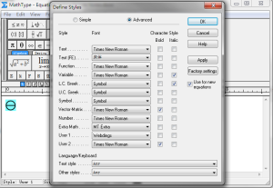
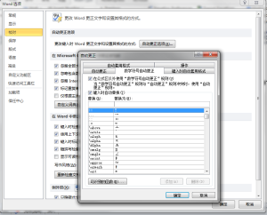

在化学/化工领域，经常使用Microsoft Office Word排版的人可能会对输入标准态符号⊖感到头疼，很多人在输入标准态符号时需要从“特殊符号”里找很久。近日偶然发现Word也可以实现一种类似于LaTeX的字符转义符号输入方式，和平日里常用的方法一起记录于此。

一、MathType中的输入方法

在化学平衡常数、标准电极电势这些常用到大量公式的地方，一般会选择MathType输入公式，而MathType虽然功能强大却也没有把标准态符号放入常用符号中，有些人可能会用希腊字幕θ去代替，但毕竟不是一个美观的方案。

实际上，我们可以用一个字体输入这个符号，即Webdings字体，这是Windows默认安装的一个字体。为了使用这个字体，需要修改一下MathType的Style设置。打开MathType输入窗口，选择Style菜单——Define，这里我将User 1的Font设置为了Webdings。

保存之后回到输入界面，输入一个y，选中y，将Style改为User 1，这个y就变成了⊖（当然，这样修改字体的方法也可以用在普通文本中，只是因为⊖一般和一串公式同时出现，所以这里以MathType中的方法为例）。设置界面及最终效果如图所示：

\[caption id="attachment\_50" align="aligncenter" width="300"\] 在MathType中输入⊖的方法\[/caption\]

二、Word中的快速输入方法

在Word中，除了使用“特殊符号”这一较为麻烦的方式之外，实际上Word提供了一种很快的输入方式，有些类似于LaTeX的通过字义转换的数学符号输入方法。其实Word还可以使用“域”这一功能实现字义转换，输入数学公式，并且其通用可编辑性强于MathType输入的。

首先，需要对Word做一些设置，选择文件——选项——校对——自动更正选项，在“数学符号自动更正”选项卡中把“在公式区以外使用‘数学符号自动更正’规则”的勾打上。

回到Word输入界面，键入\\ominus，回车，一个标准态符号就出现了，设置界面及最终效果如图所示：

\[caption id="attachment\_51" align="aligncenter" width="300"\] Word自动更正设置，打开“数学符号自动更正”\[/caption\]

\[caption id="attachment\_52" align="aligncenter" width="300"\] 自动更正法的⊖输入效果\[/caption\]
